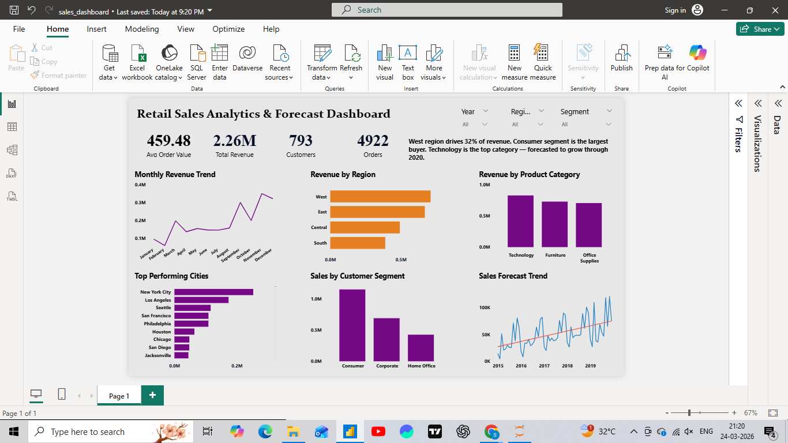

# Retail Sales Analytics & Forecast Dashboard

## Project Overview
This project analyzes retail sales data to uncover business insights and forecast future revenue trends. The analysis combines Python for data processing and forecasting, SQL for business queries, and Power BI for interactive visualization.

## Tools & Technologies
Python (Pandas, Matplotlib)
SQL
Power BI
Jupyter Notebook

## Key Features
- Sales trend analysis
- Regional revenue comparison
- Category performance analysis
- Customer segmentation insights
- Sales forecasting for the next 12 months

## Project Workflow
1. Data cleaning and preprocessing using Python
2. Business analysis using SQL queries
3. Time series forecasting using Python
4. Interactive dashboard built in Power BI

## Dashboard Preview

## Key Insights
- Technology category generates the highest revenue
- Western region contributes the largest share of sales
- Major metropolitan cities drive overall revenue growth
- Forecast analysis indicates continued upward sales trend

## Files Included
- `retail_sales_analysis.ipynb` → Python data analysis
- `sales_analysis_queries.sql` → SQL business queries
- `retail_sales_cleaned.csv` → processed dataset
- `sales_forecast.csv` → predicted sales data
- `sales_dashboard.pbix` → Power BI dashboard

## Author
Shradha Kavile
